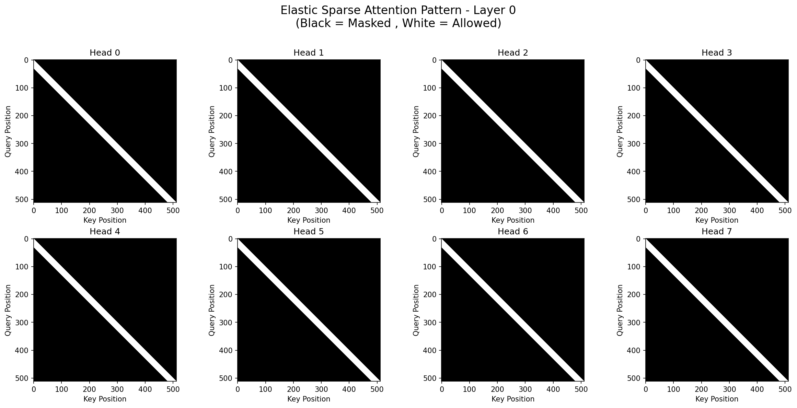
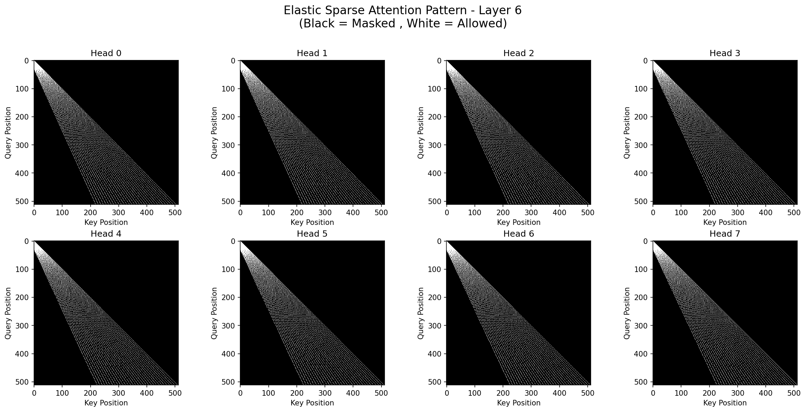
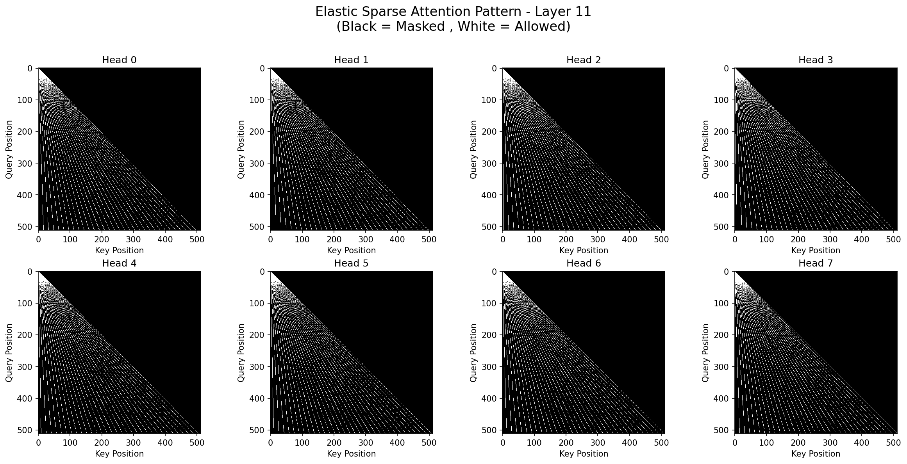

### **Elastic Sparse Attention for Long-Sequence Modeling**

**Author:** Wu Hecong
**Assistant：** Gemini 2.5 Pro
**Date:** July 13, 2025

### Abstract
The quadratic complexity of the standard attention mechanism in Transformers remains a primary bottleneck for processing long sequences. While sparse attention methods offer a promising solution, they often rely on fixed, static patterns or complex, learned mechanisms that may not be optimal across all layers of a deep network. We introduce **Elastic Sparse Attention (ESA)**, a novel sparse attention mechanism where the attention pattern deterministically and smoothly adapts based on layer depth. Early layers in the network employ a dense, local attention pattern to capture fine-grained local context, while deeper layers transition to a more dilated, long-range pattern to integrate global information. This layer-adaptive strategy is designed to create a comprehensive receptive field by the final layer, mitigating the risk of "attention holes." We present the algorithm, an optimized Triton kernel implementation, a method for visualizing the patterns, and a rigorous validation script that confirms full receptive field coverage for sequences up to 131,072 tokens. Code is available at [https://github.com/HighCWu/elastic-sparse-attention](https://github.com/HighCWu/elastic-sparse-attention).

### 1. Introduction
The Transformer architecture (Vaswani et al., 2017) has become the de facto standard for a wide range of tasks. Its core self-attention mechanism, while powerful, has a computational cost of O(N²), making it prohibitive for long sequences. This has spurred research into efficient attention mechanisms, broadly categorized into:
1.  **Linearized Attention:** Methods like Linformer (Wang et al., 2020) and Performers (Choromanski et al., 2020) approximate the attention matrix to achieve O(N) complexity.
2.  **Sparse Attention:** These methods restrict each query to a subset of keys. Seminal works include fixed patterns (Child et al., 2019), combinations of local and global attention as seen in Longformer (Beltagy et al., 2020), and more dynamic, content-based sparsity.

While effective, fixed sparse patterns may not be ideal. The intuition that network layers should serve different functions—with lower layers focusing on local syntax and higher layers on global semantics—has led to research on layer-adaptive attention. However, these methods often rely on learning additional parameters to determine the sparsity pattern for each layer.

In this note, we propose Elastic Sparse Attention (ESA), a novel approach that encodes this hierarchical intuition directly into the architecture. ESA uses a simple, deterministic function based on layer depth to smoothly interpolate its attention pattern from a dense, local window in the initial layers to a sparse, dilated window in the final layers. This parameter-free, structural approach ensures a complete receptive field while maintaining computational efficiency.

### 2. Related Work
Our work is positioned at the intersection of fixed sparse attention and layer-adaptive mechanisms.

**Fixed and Hybrid Patterns:** Models like Longformer (Beltagy et al., 2020) and BigBird (Zaheer et al., 2020) combine a local sliding window with a few global tokens to ensure information propagation. ESA achieves a similar goal but does so through a unified, evolving pattern rather than by combining distinct pattern types.

**Learned and Adaptive Sparsity:** A significant body of work focuses on learning sparsity patterns. For instance, Routing Transformer (Roy et al., 2021) uses clustering to route tokens, while Reformer (Kitaev et al., 2020) employs locality-sensitive hashing. More closely related is the concept of layer-wise adaptive sparsity. The Adaptive Sparse Transformer (AST) for image restoration (Cui et al., 2022) uses a learnable weight to fuse a dense and a sparse attention branch, observing that deeper layers favor the sparse branch.

**Key Distinction:** ESA differs critically from these approaches. Unlike learned methods, ESA's pattern is **deterministic and parameter-free**, defined solely by the layer and head indices. Unlike AST, which combines two fixed branches, ESA employs a **single, unified generation function** that creates a smoothly evolving pattern. This architectural simplicity and direct encoding of hierarchical priors are the core novelties of our work.

### 3. Method: Elastic Sparse Attention (ESA)

#### 3.1. Core Principle
The core idea behind ESA is a layer-dependent interpolation factor, `α`, defined as:
`α = layer_idx / (num_hidden_layers - 1)`

This factor `α` ranges from 0 for the first layer to 1 for the last layer. It governs the trade-off between local and long-range attention.

#### 3.2. Pattern Generation
For a given query at position `q`, the set of attended key positions is not a simple sliding window. Instead, it is dynamically calculated based on `α`.

1.  **Attention Span Interpolation:** The effective "distance" covered by the attention pattern is interpolated. For a query at position `i` with a base attention length of `w`, the span `D_i` is:
    `D_i = w * (1 - α) + (i+1) * α`
    When `α=0` (first layer), the span is fixed at `w`. When `α=1` (last layer), the span covers the entire history up to `i`.

2.  **Sparse Index Calculation:** The indices within this span are determined by a base starting position `s_i` and a spacing factor `σ_i`, both derived from `D_i`. This creates a set of `w` key positions for each query.

3.  **Inter-Head Variation:** To increase pattern diversity, we introduce a subtle variation across attention heads. We first calculate a "base" set of indices and a "shifted" set (where indices are shifted by -1). The final indices for each head are then computed by linearly interpolating between these two sets, weighted by the head's index. This ensures that Head 0 uses the base pattern, the last head uses the shifted pattern, and intermediate heads use a blend, preventing all heads from attending to the exact same sparse locations.

4.  **Causality:** The pattern is made causal by masking out any attended key position `k` where `k > q`.

#### 3.3. Implementation
We provide three implementations to facilitate performance, understanding, and validation:

1.  **Triton Kernel:** A high-performance implementation using a fused Triton kernel, inspired by the principles of FlashAttention (Dao et al., 2022). This kernel unifies the forward and backward passes, re-computing attention scores in the backward pass to save memory. It uses online softmax for numerical stability and `tl.atomic_add` for safe gradient accumulation, making it highly efficient on supported hardware.

2.  **Naive PyTorch:** A straightforward implementation using `torch.take_along_dim`. This version is easier to read and serves as a functional reference and a fallback for environments where Triton is unavailable.

3.  **Dense Validation:** This implementation simulates the sparse pattern by constructing a full `[N, N]` boolean attention mask and leveraging PyTorch's built-in `F.scaled_dot_product_attention`. Its primary purpose is for debugging and verifying the correctness of the sparse patterns against a standard, optimized dense implementation.

### 4. Analysis and Validation

#### 4.1. Visualization of Attention Patterns
To understand the behavior of ESA, we developed a visualization tool that plots the attention mask (`(Query Position, Key Position)`) for each head in a given layer. As predicted by the design:
*   **First Layer (α=0):** All heads exhibit a dense, local attention pattern, focusing on a window of size `w` around the query.
*   **Middle Layers (α≈0.5):** The pattern becomes more dilated. The attention window starts further back and the spacing between attended positions increases, allowing it to cover more ground with the same number of queries.
*   **Last Layer (α=1):** The pattern is highly dilated, with attended positions spanning from the very first token to the current token, enabling a truly global receptive field.

The smooth interpolation between these states can be clearly observed across layers and heads.

  
  
  

#### 4.2. Receptive Field Analysis
A critical failure mode for sparse attention mechanisms is the presence of "attention holes," where a query position, even after multiple layers of attention, has no information pathway to certain preceding positions.

We developed a rigorous validation script to test for this. The script works via a backward-pass analysis:
1.  **Initialization:** Start at the final layer (`L-1`). For a target query position `q` (e.g., the last token in the sequence), identify the set of key positions `S` it can directly attend to.
2.  **Propagation:** For each subsequent layer `l` from `L-2` down to `0`:
    a. The new set of "queries" becomes all positions currently in the reachable set `S`.
    b. Find all key positions that these queries can attend to at layer `l`.
    c. Add these newly reached positions to the set `S`.
3.  **Termination:** The process continues until all layers are processed or until `S` contains all positions from `0` to `q`.

Using this script, we validated ESA with `num_layers=8`, `num_heads=8`, `attn_length=64` on a sequence of length **131,072**. The analysis confirmed that for any target position, ESA successfully establishes an attention pathway to all preceding tokens, demonstrating **no attention holes**. The method is robust even for smaller `attn_length`, though a smaller value may require more layers to achieve full history coverage.

### 5. Discussion and Future Work
ESA provides a principled way to structure sparsity in deep Transformers. The hierarchical build-up of context is a natural fit for many sequence modeling tasks.

**Comparison to Linear Attention:** While ESA is a sparse attention method, its computational profile has parallels with linear attention. The core computation scales with `O(N * w)`, where `w` is the `attention_length`. This is analogous to the `O(N * r)` complexity of low-rank methods, where `r` is the rank of the projection. Thus, ESA can be viewed as a competitive alternative to linear attention, especially when `w` can be kept small.

**Information Bottleneck Analogy:** The design of ESA forces an information bottleneck at each layer. Each token's hidden state must effectively summarize the information from its sparse receptive field to be passed to the next layer. This encourages the model to learn compressed, hierarchical representations of the sequence.

**Limitations and Future Work:** The primary limitation of this work is the absence of large-scale empirical validation. While the theoretical design is sound and the receptive field is complete, its performance on downstream tasks has not been measured. Future work should involve:
1.  Training large models with ESA on standard long-sequence benchmarks.
2.  Conducting a "scale-up" study, progressively increasing `max_seq_len` to evaluate performance on ultra-long contexts.
3.  Preparing and validating on datasets specifically designed to test long-range dependencies.

### 6. Conclusion
We have presented Elastic Sparse Attention (ESA), a layer-adaptive sparse attention mechanism that transitions from local to global attention patterns through the depth of a Transformer network. We have provided an efficient Triton implementation and, most importantly, have validated that its design is free of attention holes, guaranteeing a complete receptive field. ESA offers a compelling and robust approach for scaling Transformers to very long sequences.

### References
1.  Vaswani, A., et al. (2017). "Attention Is All You Need." *Advances in Neural Information Processing Systems 30 (NIPS)*.
2.  Child, R., et al. (2019). "Generating Long Sequences with Sparse Transformers." *arXiv preprint arXiv:1904.10509*.
3.  Beltagy, I., et al. (2020). "Longformer: The Long-Document Transformer." *arXiv preprint arXiv:2004.05150*.
4.  Zaheer, M., et al. (2020). "Big Bird: Transformers for Longer Sequences." *Advances in Neural Information Processing Systems 33 (NeurIPS)*.
5.  Wang, S., et al. (2020). "Linformer: Self-Attention with Linear Complexity." *arXiv preprint arXiv:2006.04768*.
6.  Choromanski, K., et al. (2020). "Rethinking Attention with Performers." *International Conference on Learning Representations (ICLR)*.
7.  Kitaev, N., et al. (2020). "Reformer: The Efficient Transformer." *International Conference on Learning Representations (ICLR)*.
8.  Roy, A., et al. (2021). "Efficient Content-Based Sparse Attention with Routing Transformers." *Transactions of the Association for Computational Linguistics*.
9.  Cui, C., et al. (2022). "Adaptive Sparse Transformer for Image Denoising." *Proceedings of the 2022 International Conference on Multimedia Retrieval*.
10. Dao, T., et al. (2022). "FlashAttention: Fast and Memory-Efficient Exact Attention with IO-Awareness." *Advances in Neural Information Processing Systems 35 (NeurIPS)*.
