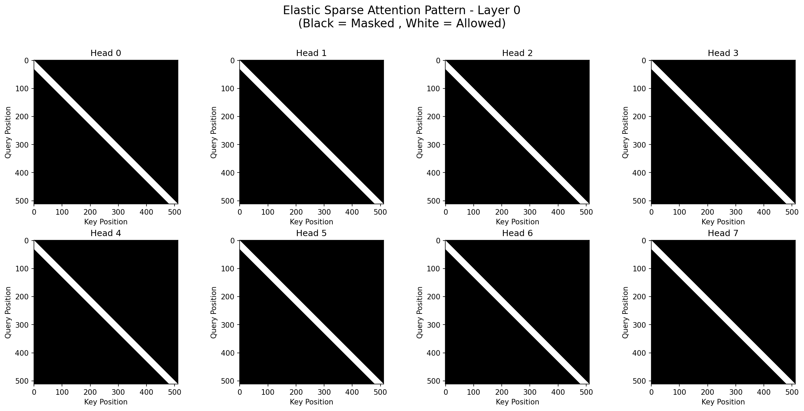
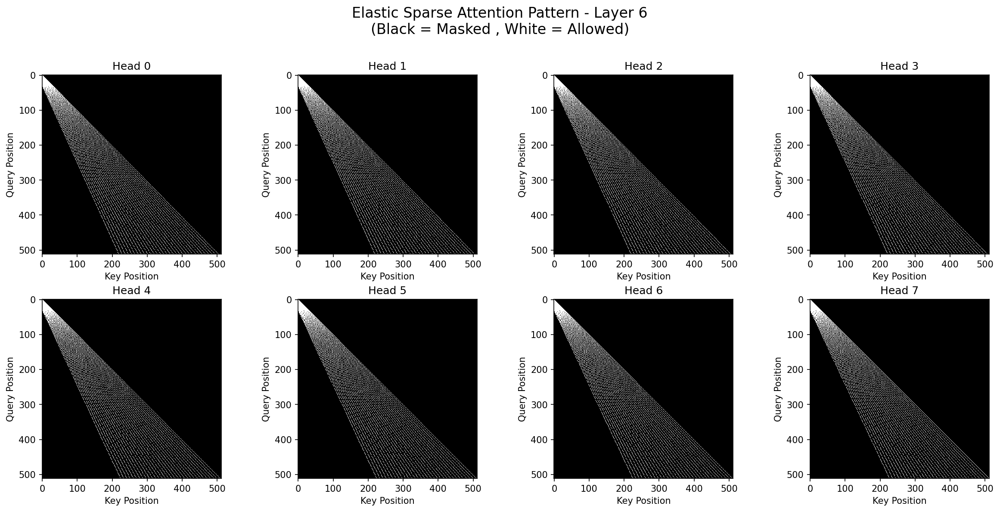
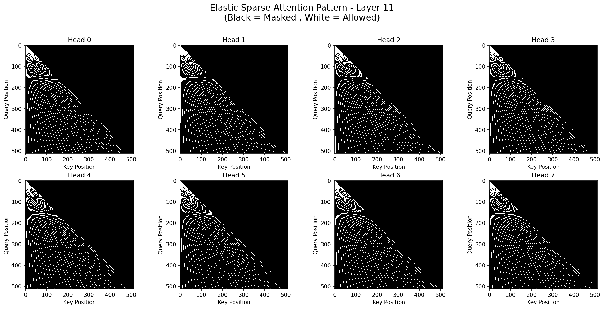

### **用于长序列建模的弹性稀疏注意力**

**作者：** 吴何聪
**助手：** Gemini 2.5 Pro
**日期：** 2025年7月13日

### 摘要
标准注意力机制的二次方复杂度仍然是处理长序列时的主要瓶颈。虽然稀疏注意力方法提供了一个有前景的解决方案，但它们通常依赖于固定的、静态的模式或复杂的、可学习的机制，这些机制可能并非在深度网络的所有层中都是最优的。我们引入了**弹性稀疏注意力（Elastic Sparse Attention, ESA）**，一种新颖的稀疏注意力机制，其注意力模式根据层深度进行确定性地、平滑地自适应调整。网络中的早期层采用密集的局部注意力模式来捕捉细粒度的局部上下文，而更深的层则过渡到一种更扩展的、长程的模式来整合全局信息。这种层自适应策略旨在通过最后一层构建一个全面的感受野，从而减轻“注意力空洞”（attention holes）的风险。我们提出了该算法、一个优化的 Triton 内核实现、一种用于可视化模式的方法，以及一个严谨的验证脚本，该脚本证实了对于长度高达 131,072 个词元的序列，ESA 能够实现完整的感受野覆盖。代码在[https://github.com/HighCWu/elastic-sparse-attention](https://github.com/HighCWu/elastic-sparse-attention)上可获取。

### 1. 引言
Transformer 架构（Vaswani et al., 2017）已成为众多任务的事实标准。其核心的自注意力机制虽然强大，但计算成本为 O(N²)，使其在处理长序列时变得不可行。这推动了对高效注意力机制的研究，大致可分为：
1.  **线性化注意力：** 如 Linformer (Wang et al., 2020) 和 Performers (Choromanski et al., 2020) 等方法通过近似注意力矩阵来实现 O(N) 复杂度。
2.  **稀疏注意力：** 这些方法限制每个查询只关注一个键的子集。开创性工作包括固定模式（Child et al., 2019）、Longformer (Beltagy et al., 2020) 中所见的局部和全局注意力的组合，以及更动态的、基于内容的稀疏性。

虽然这些方法有效，但固定的稀疏模式可能并非理想选择。“网络的不同层应扮演不同角色——底层关注局部句法，高层关注全局语义”这一直觉，已引导了对层自适应注意力的研究。然而，这些方法通常依赖于学习额外的参数来确定每层的稀疏模式。

在这篇笔记中，我们提出了弹性稀疏注意力（ESA），一种将这种分层直觉直接编码到架构中的新方法。ESA 使用一个简单的、基于层深度的确定性函数，将其注意力模式从初始层的密集局部窗口平滑地插值过渡到最终层的稀疏扩展窗口。这种无参数的结构化方法在保持计算效率的同时，确保了完整的感受野。

### 2. 相关工作
我们的工作位于固定稀疏注意力和层自适应机制的交叉点。

**固定与混合模式：**像 Longformer (Beltagy et al., 2020) 和 BigBird (Zaheer et al., 2020) 这样的模型，通过将局部滑动窗口与少数全局词元相结合来保证信息传播。ESA 实现了相似的目标，但它是通过一个统一的、演化中的模式来完成的，而不是通过组合不同的模式类型。

**可学习与自适应稀疏性：** 大量工作专注于学习稀疏模式。例如，Routing Transformer (Roy et al., 2021) 使用聚类来路由词元，而 Reformer (Kitaev et al., 2020) 则采用局部敏感哈希。与我们更相关的是层级自适应稀疏性的概念。用于图像恢复的 Adaptive Sparse Transformer (AST) (Cui et al., 2022) 使用一个可学习的权重来融合一个密集和一个稀疏的注意力分支，并观察到更深的层更偏好稀疏分支。

**关键区别：** ESA 与这些方法有本质上的不同。与可学习的方法不同，ESA 的模式是**确定性的且无参数的**，仅由层和头的索引定义。与融合两个固定分支的 AST 不同，ESA 采用一个**单一、统一的生成函数**来创建一个平滑演化的模式。这种架构上的简洁性以及对分层先验知识的直接编码，是我们工作的核心创新点。

### 3. 方法：弹性稀疏注意力（ESA）

#### 3.1. 核心原理
ESA 背后的核心思想是一个依赖于层的插值因子 `α`，其定义为：
`α = layer_idx / (num_hidden_layers - 1)`

这个因子 `α` 的范围从第一层的 0 到最后一层的 1。它控制着局部注意力和长程注意力之间的权衡。

#### 3.2. 模式生成
对于位于位置 `q` 的给定查询，其所关注的键位置集合并非一个简单的滑动窗口，而是根据 `α` 动态计算得出。

1.  **注意力跨度插值：** 注意力模式所覆盖的有效“距离”是经过插值的。对于位置 `i` 处的查询，如果基础注意力长度为 `w`，则其跨度 `D_i` 为：
    `D_i = w * (1 - α) + (i+1) * α`
    当 `α=0`（第一层）时，跨度固定为 `w`。当 `α=1`（最后一层）时，跨度覆盖了直到位置 `i` 的全部历史。

2.  **稀疏索引计算：** 此跨度内的索引由一个基础起始位置 `s_i` 和一个间距因子 `σ_i` 决定，两者都源自 `D_i`。这样为每个查询创建了一个包含 `w` 个键位置的集合。

3.  **多头间差异化：** 为了增加模式的多样性，我们在不同的注意力头之间引入了细微的变化。我们首先计算一个“基准”索引集和一个“移位”索引集（其中索引被移位-1）。然后，通过在两个集合之间进行线性插值来计算每个头的最终索引，插值权重由头的索引决定。这确保了第0个头使用基准模式，最后一个头使用移位模式，而中间的头则使用混合模式，从而防止所有头都关注完全相同的稀疏位置。

4.  **因果性：** 通过掩蔽掉任何满足 `k > q` 的被关注键位置 `k`，来确保模式的因果性。

#### 3.3. 实现
我们提供了三种实现方式，以便于提升性能、增进理解和进行验证：

1.  **Triton 内核：** 一个高性能实现，使用了融合的 Triton 内核，其灵感来源于 FlashAttention (Dao et al., 2022) 的原理。该内核统一了前向和后向传播，通过在后向传播中重新计算注意力分数来节省内存。它使用在线 softmax (online softmax) 来保证数值稳定性，并使用 `tl.atomic_add` 来进行安全的梯度累加，使其在支持的硬件上非常高效。

2.  **朴素 PyTorch 实现：** 一个使用 `torch.take_along_dim` 的直接实现。此版本更易于阅读，可作为功能参考，并在 Triton 不可用的环境中作为回退方案。

3.  **密集验证：** 此实现通过构建一个完整的 `[N, N]`布尔注意力掩码来模拟稀疏模式，并利用 PyTorch 内置的 `F.scaled_dot_product_attention`。其主要目的是用于调试和验证稀疏模式相对于标准、优化的密集实现的正确性。

### 4. 分析与验证

#### 4.1. 注意力模式可视化
为了理解 ESA 的行为，我们开发了一个可视化工具，可以为指定层中的每个头绘制其注意力掩码（`(Query Position, Key Position)`）。与设计预测的一致：
*   **第一层 (α=0):** 所有头都表现出密集的局部注意力模式，关注于查询位置周围大小为 `w` 的窗口。
*   **中间层 (α≈0.5):** 模式变得更加扩展（dilated）。注意力窗口的起始位置更靠前，被关注位置之间的间距增大，使其能用相同数量的查询覆盖更广的范围。
*   **最后一层 (α=1):** 模式高度扩展，被关注的位置从第一个词元一直延伸到当前词元，从而实现了真正的全局感受野。

在不同层和不同头之间，可以清晰地观察到这些状态之间的平滑插值。

  
  
  

#### 4.2. 感受野分析
稀疏注意力机制的一个关键失效模式是存在“注意力空洞”，即一个查询位置即使经过多层注意力，也无法与某些先前的特定位置建立信息通路。

我们开发了一个严谨的验证脚本来测试此问题。该脚本通过一种反向传播式的分析工作：
1.  **初始化：** 从最后一层（`L-1`）开始。对于一个目标查询位置 `q`（例如序列的最后一个词元），确定它能直接关注到的键位置集合 `S`。
2.  **传播：** 从 `L-2` 层到第 `0` 层，对于每一层 `l`：
    a. 新的“查询”集合变成当前可达集合 `S` 中的所有位置。
    b. 找出这些查询在 `l` 层能关注到的所有键位置。
    c. 将这些新到达的位置添加到集合 `S` 中。
3.  **终止：** 该过程持续进行，直到处理完所有层，或者集合 `S` 包含了从 `0` 到 `q` 的所有位置。

使用此脚本，我们在一个长度为 **131,072** 的序列上，对 `num_layers=8`, `num_heads=8`, `attn_length=64` 的 ESA 进行了验证。分析证实，对于任何目标位置，ESA 都能成功地建立到所有先前词元的注意力通路，证明了**不存在注意力空洞**。即使对于较小的 `attn_length`，该方法也是稳健的，尽管较小的值可能需要更多层才能实现完整的历史覆盖。

### 5. 讨论与未来工作
ESA 为在深度 Transformer 中构建稀疏性提供了一种有原则性的方法。上下文的分层构建方式自然地契合了许多序列建模任务。

**与线性注意力的比较：** 虽然 ESA 是一种稀疏注意力方法，但其计算特性与线性注意力有相似之处。核心计算的复杂度与 `O(N * w)` 成正比，其中 `w` 是 `attention_length`。这类似于低秩方法的 `O(N * r)` 复杂度，其中 `r` 是投影的秩。因此，ESA 可以被视为线性注意力的一种有竞争力的替代方案，尤其是在 `w` 可以保持较小的情况下。

**信息瓶颈类比：** ESA 的设计在每一层都强制形成一个信息瓶颈。每个词元的隐藏状态必须有效地总结其稀疏感受野中的信息，以便传递给下一层。这鼓励模型学习序列的压缩的、分层的表示。

**局限与未来工作：** 这项工作的主要局限是缺乏大规模的实证验证。尽管理论设计是合理的，并且感受野是完整的，但其在下游任务上的性能尚未被衡量。未来的工作应包括：
1.  在标准的长序列基准上，使用 ESA 训练大型模型。
2.  进行“规模扩展”研究，逐步增加 `max_seq_len` 来评估在超长上下文中的性能。
3.  准备并验证专门为测试长程依赖而设计的数据集。

### 6. 结论
我们介绍了弹性稀疏注意力（ESA），一种层自适应的稀疏注意力机制，它在 Transformer 网络的深度方向上从局部注意力模式过渡到全局注意力模式。我们提供了一个高效的 Triton 实现，并且最重要的是，我们验证了其设计不存在注意力空洞，保证了完整的感受野。ESA 为将 Transformer 扩展到极长序列提供了一个有吸引力且稳健的方法。

### 参考文献
1.  Vaswani, A., et al. (2017). "Attention Is All You Need." *神经信息处理系统进展 30 (NIPS)*.
2.  Child, R., et al. (2019). "Generating Long Sequences with Sparse Transformers." *arXiv 预印本 arXiv:1904.10509*.
3.  Beltagy, I., et al. (2020). "Longformer: The Long-Document Transformer." *arXiv 预印本 arXiv:2004.05150*.
4.  Zaheer, M., et al. (2020). "Big Bird: Transformers for Longer Sequences." *神经信息处理系统进展 33 (NeurIPS)*.
5.  Wang, S., et al. (2020). "Linformer: Self-Attention with Linear Complexity." *arXiv 预印本 arXiv:2006.04768*.
6.  Choromanski, K., et al. (2020). "Rethinking Attention with Performers." *国际学习表征会议 (ICLR)*.
7.  Kitaev, N., et al. (2020). "Reformer: The Efficient Transformer." *国际学习表征会议 (ICLR)*.
8.  Roy, A., et al. (2021). "Efficient Content-Based Sparse Attention with Routing Transformers." *计算语言学协会汇刊*.
9.  Cui, C., et al. (2022). "Adaptive Sparse Transformer for Image Denoising." *2022年国际多媒体检索会议论文集*.
10. Dao, T., et al. (2022). "FlashAttention: Fast and Memory-Efficient Exact Attention with IO-Awareness." *神经信息处理系统进展 35 (NeurIPS)*.
